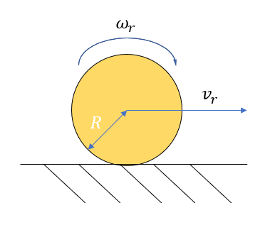
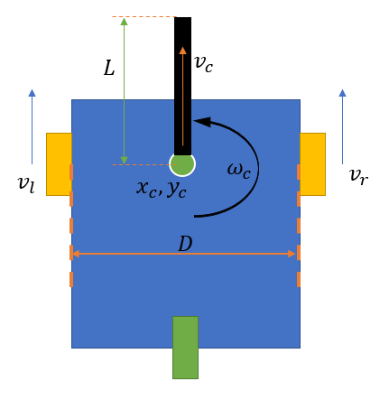

# 6631 Project Plan

## Tasks for now
- design our own robots: may find suitable mesh and surface, using links in "useful_graphics_links.txt"
- design an automated robot to be first player
- design a robot which can be controled via keyboard as the second player

## Useful Information

There is no wheel slipping

$$ v_r = \omega_r R $$
Where $v_r$ is the linear velocity, $R$ is the radius of wheel, and $\omega_r$ is the angular velocity.

$x_c$ and $y_c$ is the coordinate of the vehicle centre. $\theta$ is the direction of vehicle. $D$ is the distance bewteen two wheels. The geometry model of this vehicle is shown below:
$$ v_c = (v_r+v_l)/2 $$
$$ \omega_c = ( v_r - v_l ) / D $$
$$ \dot{\theta_c} = \omega_c = ( v_r - v_l ) / D $$